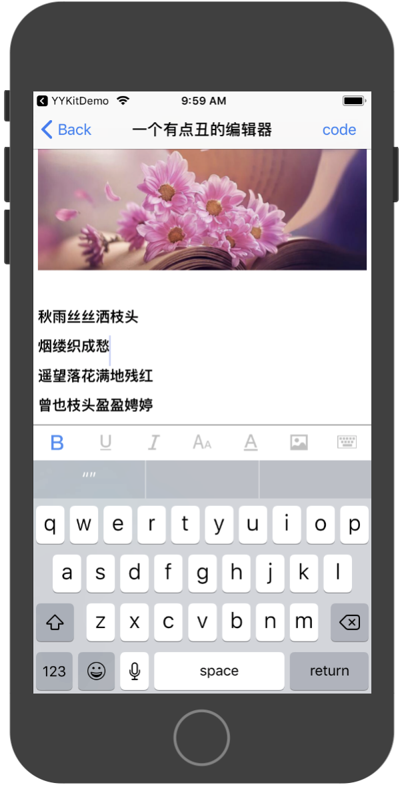

<h3>
一个简易的富文本编辑器。支持html格式，仅仅基于UITextView实现，原理简单，易于扩展。 
支持功能： 
1.添加本地图片 
2.字体可以调整粗细、大小、字色、斜体。  
  
说明： 
实际使用时，需要添加自己的图片上传请求。
可以参照SIXHTMLParser类中（+ (void)sync_htmlStringWithAttributedText:）方法，在末尾的注释进行添加。
  
</h3>

</img>
 
 
</img>

